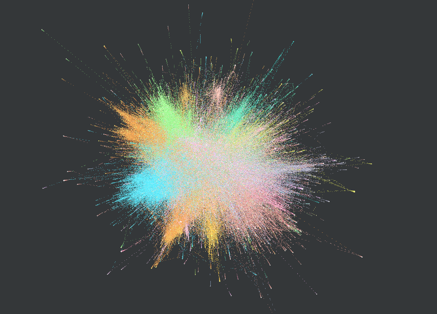
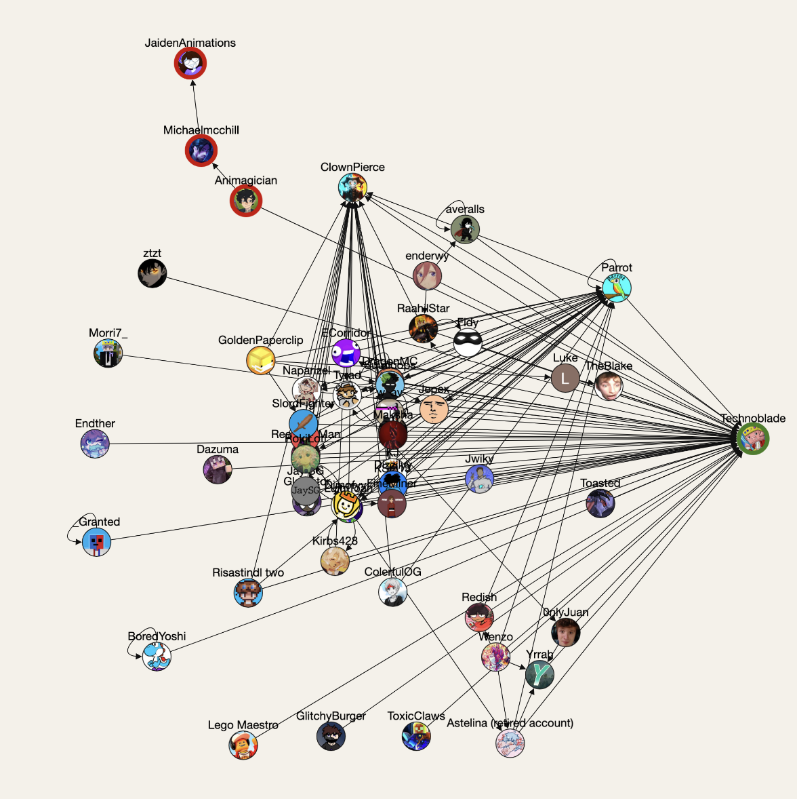
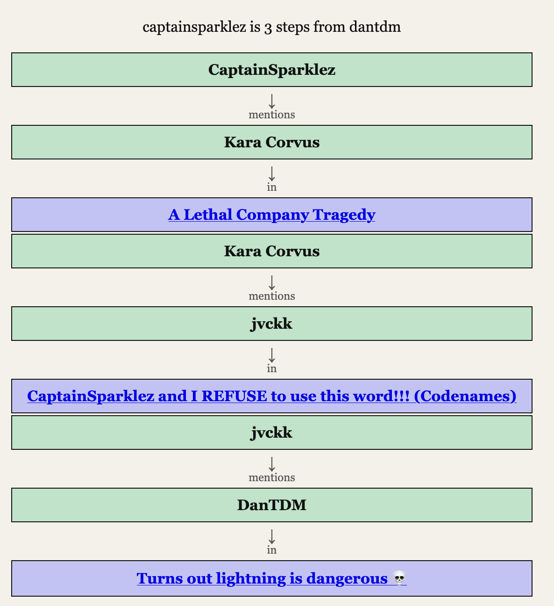
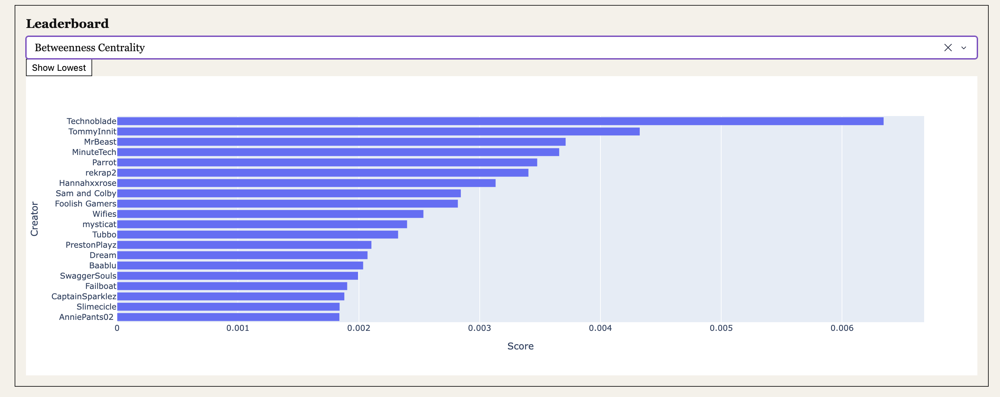
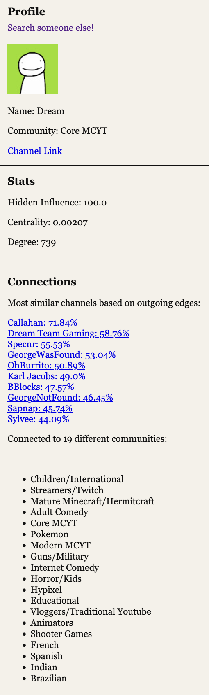

# The Minecraft Map

**Quick Links**

- [Project Article](https://www.andreprakash.com/posts/minecraft-map/)
- Website: [website to be added]
- 



## What is this?

This project was to create and analyze a network/graph of Minecraft YouTube channels. Nodes in the graph represent _youtube channels_ and an edge from $C_0$ to $C_1$ means that the channel $C_0$ mentioned $C_1$ in a recent video.

This project consists of three core components:

- A graph creation script that uses a BFS crawl to find new channels and edges
- A series of graph analysis scripts to run tests like community detection, betweenness centrality identification, and much more
- A web app (Plotly Dash frontend, Flask backend) to present the graph data, a graph explorer, individual node data, and a fun "shortest path" feature that finds the shortest path of mentions from one creator to another

For more details, please check out any of the quick links above.

## Media

<table>
  <tr>
    <td align="center" width="50%">
      <br>
      <b>Graph Explorer</b>
    </td>
    <td align="center" width="50%">
      <br>
      <b>Shortest Path</b>
    </td>
  </tr>
</table>

<p align="center">
  <br>
  <b>Centrality Leaderboard</b>
</p>

<p align="center">
  <br>
  <b>Creator Stats</b>
</p>

## How to run yourself

**Missing Data**

GitHub doesn't support large files like the data analysis files used in this project. I am currently working on getting these uploaded to some sort of file storage service.

When they're available, they'll be linked at the top of the ReadMe and this section will be replaced with usage instructions.

**Install requirements**

From the root directory:
`pip install -r requirements.txt`

**Building the graph**

Read the Documentation to get an idea for how the graph works, and then set the path to your seed file in `main.py`.

_Pro tip: if you don't want to just do Minecraft Youtubers, use a seed 100-1000 channels from whatever community you want_

In your `.env`, have your Deepseek API token saved as `DEEPSEEK_KEY`, and have one or more Youtube Data API keys. Store the variable names that your api keys are stored as in the `YT_KEYS` list in `main.py`

_Example:_

```
YT_API_KEY1 = ""
YT_API_KEY2 = ""
DEEPSEEK_KEY =""
```

Then let 'er rip: **`python main.py`**. Pause and check the `unresolved.json` and `failed_channels.json` occasionally to keep the queue up to date.

**Running analysis**

Make sure your `graph.graphml` file is in `data/fin_data/`

There are a series of different analysis functions in `/data-analysis-scripts`. These include (but are not limited to) functions to:

- Calculate betweenness
- Identify and merge communities
- Calculate hidden influence
- Identify community bridges

**Running the webpage**

Make sure your `graph.graphml` file is in `data/fin_data/`

First, start the backend and wait for the "Graph Loaded" message
`python backend/graph_api.py`

Next, start the frontend
`python dash_site/app.py`
